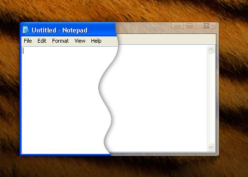



## Translucent Vista Style Subclassing

### Description

This is an example of subclassing a window, and moving it around using another form. It's set up to use as a custom form border that is translucent, resembling the Aero effects of Vista. For the example I subclassed notepad to have the Vista style translucent border, though you could apply it to any window.
 
### More Info
 

             |
---                |---
**Submitted On**   |2005-10-30 14:03:52
**By**             |[Jesse Seidel](https://github.com/Planet-Source-Code/PSCIndex/blob/master/ByAuthor/jesse-seidel.md)
**Level**          |Intermediate
**User Rating**    |4.6 (37 globes from 8 users)
**Compatibility**  |VB 6\.0
**Category**       |[Custom Controls/ Forms/  Menus](https://github.com/Planet-Source-Code/PSCIndex/blob/master/ByCategory/custom-controls-forms-menus__1-4.md)
**World**          |[Visual Basic](https://github.com/Planet-Source-Code/PSCIndex/blob/master/ByWorld/visual-basic.md)
**Archive File**   |[Translucen2015068222006\.zip](https://github.com/Planet-Source-Code/jesse-seidel-translucent-vista-style-subclassing__1-66337/archive/master.zip)

